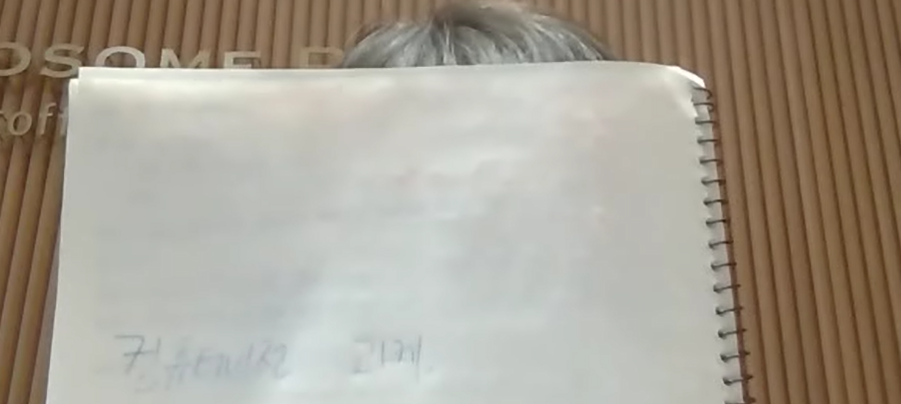
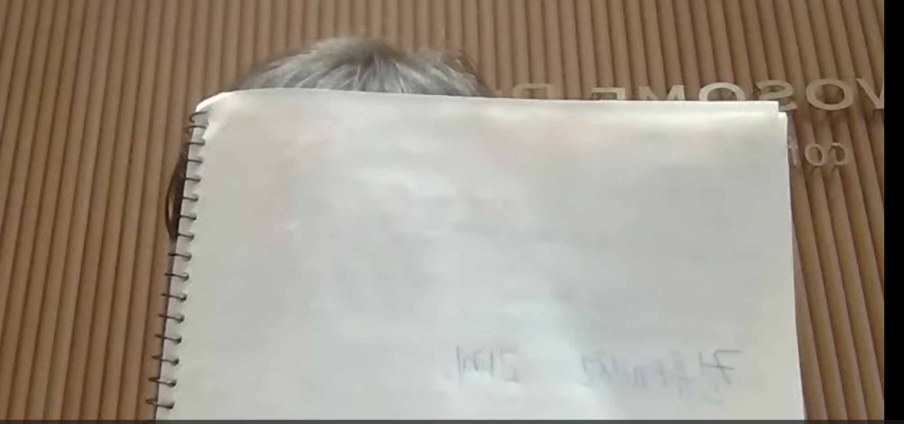

# HandlingVideo

OpenCV를 이용해 카메라 영상을 실시간으로 표시하고, 필요 시 녹화할 수 있는 간단한 비디오 레코더입니다.  
`hw1.py`를 실행하면 아래와 같은 기능을 통해 동영상을 핸들링할 수 있습니다.

Space 키: Preview ↔ Record 모드 전환

F 키: Flip(좌우 반전) 토글

ESC 키: 프로그램 종료

---

## 1. 카메라 열기 및 기본 설정

```python 
cap = cv.VideoCapture(0)
if not cap.isOpened():
    print("카메라를 열 수 없습니다.")
    return
fourcc = cv.VideoWriter_fourcc(*'XVID')
fps = 20.0
width = int(cap.get(cv.CAP_PROP_FRAME_WIDTH))
height = int(cap.get(cv.CAP_PROP_FRAME_HEIGHT))
 ```

cv.VideoCapture(0)에서 0은 내장 웹캠을 의미합니다.

fourcc는 동영상을 어떤 코덱으로 저장할지 설정합니다.

fps는 초당 몇 프레임으로 녹화할지 결정합니다.

width, height는 카메라 영상의 해상도(프레임 크기)를 가져옵니다.


## 2. Preview/Record 모드 전환 기능

```python
record_mode = False
out = None
flip_enabled = False
#이하 사용자 안내 메세지
print("=== My Awesome Video Recorder ===")
print("[Space] : Preview/Record 모드 전환")
print("[F]     : Flip(좌우 반전) 토글")
print("[ESC]   : 프로그램 종료")
while True:
    ret, frame = cap.read()
    if not ret:
        print("프레임을 가져올 수 없습니다.")
        break
 ```

record_mode가 False면 Preview 모드, True면 Record 모드입니다.

프로그램 실행 시 사용자 안내 메시지가 표시됩니다.

카메라에서 프레임을 읽어들이되, 가져오지 못하면 종료합니다.


## 3. 좌우 반전 기능
```python
if flip_enabled:
    frame = cv.flip(frame, 1)
 ```

flip_enabled가 True일 때 cv.flip(frame, 1)을 적용하여 좌우 반전합니다.

F 키를 누르면 flip_enabled가 토글됩니다.


## 4. 레코드 모드 처리
```python
if record_mode and out is not None:
    out.write(frame)
    cv.circle(frame, (width - 30, 30), 15, (0, 0, 255), -1)
 ```

Record 모드이고 out이 설정되어 있으면, frame을 동영상 파일에 저장.

동시에 화면 상단 오른쪽에 빨간 원을 그려 녹화 중임을 표시합니다.


## 5. 화면에 현재 프레임 표시
```python
cv.imshow('My Awesome Video Recorder', frame)
 ```

현재 처리된 프레임(좌우 반전 여부, 빨간 원 표시 등)을 창(My Awesome Video Recorder)에 표시합니다.


## 6. 키 입력 처리
```python
key = cv.waitKey(30) & 0xFF
if key == 27:  # ESC 키
    print("프로그램을 종료합니다.")
    break
elif key == 32:  # Space 키
    record_mode = not record_mode
    if record_mode:
        print("Record 모드로 전환 (녹화 시작)")
        out = cv.VideoWriter('output.avi', fourcc, fps, (width, height))
    else:
        print("Preview 모드로 전환 (녹화 중지)")
        if out is not None:
            out.release()
            out = None
elif key == ord('f') or key == ord('F'):
    flip_enabled = not flip_enabled
    print(f"Flip 모드 {'활성화' if flip_enabled else '비활성화'}")
 ``` 

ESC 키로 프로그램 종료

Space 키로 모드를 전환

Record 모드로 전환 시 VideoWriter를 생성해 파일(output.avi)에 녹화

Preview 모드로 돌아오면 VideoWriter 해제

F 키로 좌우반전 기능을 on/off


## 7. 종료 
```python
cap.release()
if out is not None:
    out.release()
cv.destroyAllWindows()
 ``` 

카메라(cap)와 VideoWriter(out) 리소스를 해제하고, OpenCV 창을 닫습니다.

## 8. 실행예시(스크린샷)





